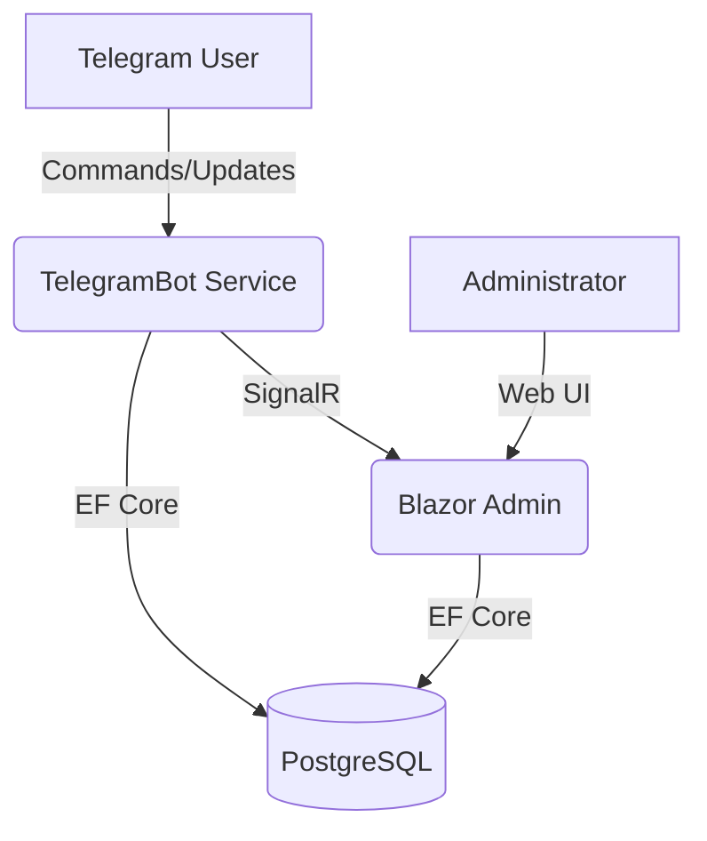

# OmniCart.NET 🛒

[](https://dotnet.microsoft.com/download)
[](https://mudblazor.com/)
[](https://www.docker.com/)
[](LICENSE)

**OmniCart.NET** — это современная open-source экосистема для электронной коммерции, объединяющая удобство Telegram-бота для покупателей и мощь административной панели на Blazor для управления бизнесом.

Построен на передовом стеке технологий .NET 10 и ориентирован на высокую производительность и масштабируемость.

---

## ✨ Основные возможности

### 🤖 Telegram Бот (Storefront)
*   **FSM (Finite State Machine)**: Надежная логика состояний пользователя для бесшовного процесса покупки.
*   **Умный каталог**: Листайте товары с удобной пагинацией.
*   **Управление корзиной**: Добавление в один клик, проверка остатков в реальном времени.
*   **Гибкая доставка**: Поддержка нескольких сохраненных адресов для каждого пользователя.
*   **История заказов**: Просмотр статусов и деталей прошлых покупок.
*   **Профиль и настройки**: Управление персональными данными (телефон, адреса).

### 🖥 Blazor Admin Panel (Backoffice)
*   **Live Dashboard**: Интерактивные графики продаж (MudChart), статистика выручки, активных клиентов и заказов.
*   **Real-time Notifications**: Мгновенные звуковые и визуальные уведомления о новых заказах через SignalR.
*   **Управление товарами**: Полноценный CRUD, управление складскими остатками, фильтрация и поиск.
*   **Обработка заказов**: Смена статусов, просмотр состава заказов, управление базой клиентов.
*   **Современный UI**: Адаптивный темный/светлый дизайн на базе MudBlazor с кастомной палитрой Indigo/Slate.

---

## 🛠 Стек технологий

*   **Framework**: .NET 10 (C#)
*   **Database**: PostgreSQL + Entity Framework Core
*   **Frontend**: Blazor Server + MudBlazor 9.5.0
*   **Real-time**: ASP.NET Core SignalR
*   **Bot API**: Telegram.Bot
*   **Infrastructure**: Docker & Docker Compose
*   **Hosting Support**: Оптимизировано для Neon Cloud PostgreSQL

---

## 🏗 Архитектура

Проект следует принципам Clean Architecture:



1.  **Domain**: Ядро системы — сущности (User, Order, Product) и бизнес-правила.
2.  **Infrastructure**: Реализация БД (AppDbContext), миграции и логика обработчика Telegram.
3.  **TelegramBot**: Фоновый сервис (Worker), обеспечивающий взаимодействие с Telegram API.
4.  **OmniCart.BlazorAdmin**: Веб-приложение для управления магазином.

---

## 🚦 Быстрый запуск

### Вариант 1: Docker (Самый быстрый)

1. Клонируйте репозиторий:
   ```bash
   git clone https://github.com/your-repo/OmniCart.NET.git
   cd OmniCart.NET
   ```
2. Подготовьте переменные окружения в `docker-compose.yml` или через экспорты:
   ```bash
   export POSTGRES_PASSWORD=your_password
   export TELEGRAM_BOT_TOKEN=your_bot_token
   ```
3. Запустите всё одной командой:
   ```bash
   docker-compose up -d --build
   ```
4. Админка будет доступна по адресу: `http://localhost:8080`

### Вариант 2: Локальная разработка

1. **База данных**: Убедитесь, что у вас установлен PostgreSQL или используйте Neon.tech.
2. **Настройка**: Укажите токен бота и строку подключения в `TelegramBot/appsettings.json` и `OmniCart.BlazorAdmin/appsettings.json`.
3. **Запуск миграций**:
   ```bash
   dotnet ef database update --project Infrastructure --startup-project TelegramBot
   ```
4. **Запуск проектов**:
   Используйте Visual Studio (OmniCart.NET.slnx) или dotnet CLI:
   ```bash
   dotnet run --project OmniCart.BlazorAdmin
   dotnet run --project TelegramBot
   ```

---

## ⚙️ Конфигурация

Ключевые параметры в `appsettings.json`:

| Параметр | Описание |
| :--- | :--- |
| `TelegramBotSettings:Token` | Токен вашего бота от @BotFather |
| `ConnectionStrings:DefaultConnection` | Строка подключения к PostgreSQL |
| `SignalR:HubUrl` | URL хаба для уведомлений (для бота) |

---

## 🤝 Контрибьютинг

Мы приветствуем Pull Requests! Для крупных изменений, пожалуйста, сначала откройте Issue, чтобы обсудить, что вы хотите изменить.

1. Fork проекта
2. Создайте ветку (`git checkout -b feature/AmazingFeature`)
3. Commit изменений (`git commit -m 'Add some AmazingFeature'`)
4. Push в ветку (`git push origin feature/AmazingFeature`)
5. Откройте Pull Request

---

## 📄 Лицензия

Распространяется под лицензией MIT. Подробнее в файле `LICENSE`.

---
Разработано с ❤️ для сообщества .NET.
